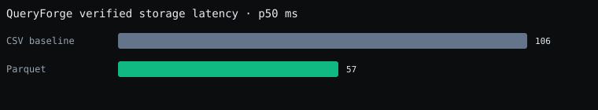
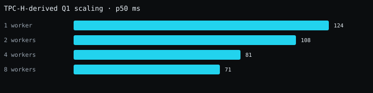

# QueryForge verification report

Status: **passed**

Generated: 2026-10-02T09:29:55.046Z

- Differential: 100 queries
- Join: 3 queries, local
- Approximation: uniform, Zipfian, and adversarial gates passed
- Scaling: 1/2/4/8 workers, 5 measured runs after warm-up
- Adaptive skew: 3673 ms static → 3200 ms adaptive p50
- MapReduce: median combiner transfer reduction 99.6%; injected p99 1008 → 329 ms
- Spark-style abstractions: lazy plan p95 11 ms; cold/warm cache 84 → 106 ms; one-partition recovery checksum preserved
- Cost Analyzer: 5 canonical autopsies and 5 checksum-safe workload replays
- Streaming SQL: 601 accepted events, 0 duplicate/lost; TUMBLE/HOP/SESSION fixture passed
- Chaos: 5 injected modes
- Worker crash checksum: d46abbd4e4f640721d5eed677f788241abf1f6f7b574b188a9590de80f2a9a55
- Coordinator restart checksum: d916efcaafb0176a3ec8de3d7c34357ae5c9f97818f200725bed0b35d6faec64

